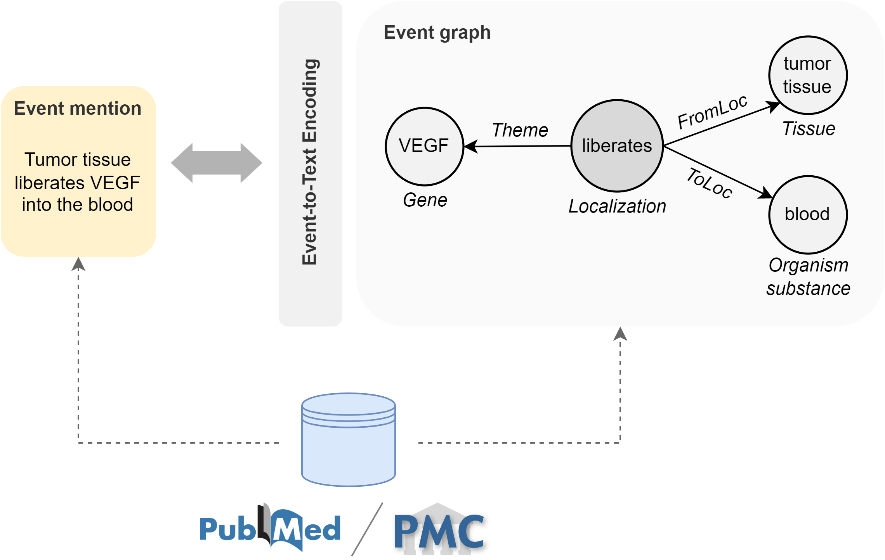

# Text-to-Text Extraction and Verbalization of Biomedical Event Graphs

This repository provides the source code & data of our paper: [Text-to-Text Extraction and Verbalization of Biomedical Event Graphs]().

In bioinformatics, events represent complex interactions mentioned in the scientific literature, involving a set of entities (e.g., proteins, genes, diseases, drugs), each contributing with a specific semantic role (e.g., theme, cause, site). For instance, biomedical events include molecular reactions, organism-level outcomes, and adverse drug reactions.
Text-to-event (or event extraction, EE) and event-to-text (or event graph verbalization, EGV) systems effectively bridge natural language and symbolic representations. They provide a step towards decoupling concept units (what to say) from language competencies (how to say it).
Almost all contributions in the event realm orbit around semantic parsing, usually employing discriminative architectures and cumbersome multi-step pipelines limited to a small number of target interaction types. Despite being less explored, EGV holds a lot of potential as well, targeting the generation of informative text constrained on semantic graphs, crucial in applications like conversational agents and summarization systems. 
We present the first lightweight framework to solve both event extraction and event verbalization with a unified text-to-text approach, allowing us to fuse all the resources so far designed for different tasks.
To this end, we present a new event graph linearization technique and release highly comprehensive event-text paired datasets (BioT2E and BioE2T), covering more than 150 event types from multiple biology subareas (English language). By streamlining parsing and generation to translations, we propose baseline transformer model results according to multiple biomedical text mining benchmarks and natural language generation metrics. Our extractive models achieve greater state-of-the-art performance than single-task competitors and show promising capabilities for the controlled generation of coherent natural language utterances from structured data.

  

- [Text-to-Text Extraction and Verbalization of Biomedical Event Graphs](#text-to-text-extraction-and-verbalization-of-biomedical-event-graphs)
  - [Requirements](#requirements)
  - [Datasets](#datasets)
    - [Original EE datasets](#original-ee-datasets)
    - [BioT2E and BioE2T](#biot2e-and-bioe2t)
  - [Models](#models)
    - [Evaluation](#evaluation)
      - [T5X](#t5x)
      - [BART](#bart)
    - [Checkpoints](#checkpoints)
  - [✉ Contacts](#-contacts)
  - [Citation](#citation)

## Requirements

General
- Python (verified on 3.8)
- CUDA (verified on 11.1)

Python Packages
- See `docker/requirements.txt`

## Datasets

### Original EE datasets
Our BioE2T and BioT2E datasets are derived from 10 influential benchmarks originally designed for biomedical EE (BEE) and primarily released within BioNLP-ST competitions. For your convenience, we include these freely accessible benchmarks directly within the repository: `data/datasets/original_datasets.tar.gz`.

<table>
  <tr>
   <th>Corpus</th>
   <th>Domain</th>
   <th>#Documents</th>
   <th>Annotation Schema</th>
  </tr>
  <tr>
   <th>Genia Event Corpus (GE08)</th>
   <th>Human blood cells transcription factors</th>
   <th>1,000 abstracts</th>
   <th>35 entity types, 35 event types</th>
  </tr>
  <tr>
   <th>Genia Event 2011 (GE11)</th>
   <th>See Genia08 </th>
   <th>1,210 abstracts, 14 full papers</th>
   <th>2 entity types, 9 event types, 2 modifiers</th>
  </tr>
  <tr>
   <th>Epigenetics and Post-translational Modification (EPI11)</th>
   <th>Epigenetic change and common protein post-translational modifications</th>
   <th>1,200 abstracts</th>
   <th>2 entity types, 14 event types, 2 modifiers</th>
  </tr>
  <tr>
   <th>Infectious Diseases (ID11)</th>
   <th>Two-component regulatory systems</th>
   <th>30 full papers</th>
   <th>5 entity types, 10 event types, 2 modifiers</th>
  </tr>
  <tr>
   <th>Multi-Level Event Extraction (MLEE)</th>
   <th>Blood vessel development from the subcellular to the whole organism</th>
   <th>262 abstracts</th>
   <th>16 entity types, 19 event types</th>
  </tr>
  <tr>
   <th>GENIA-MK</th>
   <th>See GE08</th>
   <th>1,000 abstracts</th>
   <th>35 entity types, 35 event types, 5 modifiers (+2 inferable)</th>
  </tr>
  <tr>
   <th>Genia Event 2013 (GE13)</th>
   <th>See GE08</th>
   <th>34 full papers</th>
   <th>2 entity types, 13 event types, 2 modifiers</th>
  </tr>
  <tr>
   <th>Cancer Genetics (CG13)</th>
   <th>Cancer biology</th>
   <th>600 abstracts</th>
   <th>18 entity types, 40 event types, 2 modifiers</th>
  </tr>
  <tr>
   <th>Pathway Curation (PC13)</th>
   <th>Reactions, pathways, and curation</th>
   <th>525 abstracts</th>
   <th>4 entity types, 23 event types, 2 modifiers</th>
  </tr>
  <tr>
   <th>Gene Regulation Ontology (GRO13)</th>
   <th>Human gene regulation and transcription</th>
   <th>300 abstracts</th>
   <th>174 entity types, 126 event types</th>
  </tr>
</table>

### BioT2E and BioE2T
We publicly release our BioT2E (`data/datasets/biot2e`) and BioE2T (`data/datasets/bioe2t`) text-to-text datasets for event extraction and event graph verbalization, respectively. For replicability, we also provide the preprocessing, filtering, and sampling scripts (`notebooks/create_datasets.ipynb`) used for their automatic generation mostly from EE datasets following a _.txt/.a1/.a2_ or _.ann_ structure.

## Models

We trained and evaluated T5 and BART models.
* We reimplemented T5-Base (∼220M parameters, 12-layers, 768-hidden, 12- heads) in Flax (T5X) starting from the [Google Research codebase](https://github.com/google-research/t5x); see `https://github.com/disi-unibo-nlp/bio-ee-egv/blob/main/src/utils/t5x`.
* We built our BART-Base (∼139M, 12-layers, 768-hidden, 16-heads) model in PyTorch using the [HuggingFace’s Transformers library](https://huggingface.co/transformers/model_doc/bart.html).

### Evaluation

1. Generate prediction files using the following scripts.
2. Check the evaluation notebook (`./notebooks/evaluate_ee.ipynb`) to run the automatic evaluation.

#### T5X

* EE → `python3 ./src/test_scripts/t5x/test_ee_t5.py`
* EGV → `python3 ./src/test_scripts/t5x/test_egv_t5.py`
* PubMed Summ → `python3 ./src/test_scripts/t5x/test_summarization_t5.py`
* Multi-task Learning (EE + EGV + PubMed Summ) → `python3 ./src/test_scripts/t5x/test_mtl_t5.py`

#### BART

* EE → `python3 ./src/test_scripts/bart/test_ee_bart.py`
* EGV → `python3 ./src/test_scripts/bart/test_egv_bart.py`

### Checkpoints

<table>
  <tr>
    <th rowspan="3">EE</th>
    <th>Trained model</th>
    <th>Val F1 (%), AVG on 10 benchmarks</th>
  </tr>
  <tr>
    <th>T5[BioT2E] <a href="https://drive.google.com/file/d/1uZj5aF9EBWv_4gMYRwfmCtnmUDmunw3v/view?usp=sharing">[link]</a></th>
    <th>80.25</th>
  </tr>
  <tr>
    <th>BART[BioT2E] <a href="https://drive.google.com/file/d/1wT3SfP3zvvtCHlv-sjV3qUvnskOZ6Qio/view?usp=sharing">[link]</a></th>
    <th>73.50</th>
  </tr>
  <tr>
    <th rowspan="3">EGV</th>
    <th>Trained model</th>
    <th>Val ROUGE-1/2/L F1 AVG (%)</th>
  </tr>
  <tr>
    <th>T5[BioE2T] <a href="https://drive.google.com/file/d/1U09wyt2fEpDeKgmPdtvghIInrzf9GpPQ/view?usp=sharing">[link]</a></th>
    <th>65.40</th>
  </tr>
  <tr>
    <th>BART[BioE2T] <a href="https://drive.google.com/file/d/1CSsUlbH_-ItE9tt8oC3LFNJz7fyIwm3-/view?usp=sharing">[link]</a></th>
    <th>54.30</th>
  </tr>
</table>

## ✉ Contacts

* Giacomo Frisoni, [giacomo.frisoni[at]unibo.it](mailto:giacomo.frisoni@unibo.it) ♣
* Gianluca Moro, [gianluca.moro[at]unibo.it](mailto:paolo.italiani@studio.unibo.it)
* Lorenzo Balzani, [balzanilo[at]icloud.com](mailto:balzanilo@icloud.com) ♣

♣ = Mantainers

If you have troubles, suggestions, or ideas, the [Discussion](https://github.com/disi-unibo-nlp/bio-ee-egv/discussions) board might have some relevant information. If not, you can post your questions there 💬🗨.

## License

This project is released under the CC-BY-NC-SA 4.0 license (see `LICENSE`).

## Citation

If you use the reported code, datasets, or models in your research, please cite:

    @inproceedings{frisoni-etal-2022-text,
      title = "Text-to-Text Extraction and Verbalization of Biomedical Event Graphs",
      author = "Frisoni, Giacomo  and
        Moro, Gianluca  and
        Balzani, Lorenzo",
      booktitle = "Proceedings of the 29th International Conference on Computational Linguistics",
      month = oct,
      year = "2022",
      address = "Gyeongju, Republic of Korea",
      publisher = "International Committee on Computational Linguistics",
      url = "https://aclanthology.org/2022.coling-1.238",
      pages = "2692--2710"
    }
